# Kindora 🌱  

  

### Reduce Food Waste • Help the Needy • Community Driven Platform

🔗 **Live Website:**  
https://kindora-backend-1.onrender.com/

📧 **Contact:**  
akkanavenkatahematej@gmail.com

---

## 📌 About the Project

**Kindora** is a full-stack web application designed to reduce food waste and help people and animals in need.  
It connects **donors** who want to donate surplus food, clothes, or animal food with **members (volunteers)** who collect and distribute these donations to nearby needy people and animals.

This project focuses on:
- Social impact
- Real-world workflows
- Location-based donations
- Role-based user experience

> ⚠️ **Source code is private. Access can be provided upon request.**

---

## 👥 User Roles & Workflow

### 🔹 1. Donor Flow
1. Login / Register to the platform
2. Donate:
   - 🍲 Food
   - 👕 Clothes
   - 🐶 Animal Food
3. Provide:
   - Pickup location
   - Availability timings
   - Donation images
4. View **Donation History**
5. When a member accepts the donation:
   - Member contact details are displayed
6. After delivery:
   - Proof images uploaded by the member are visible

---

### 🔹 2. Member (Volunteer) Flow
1. Update profile
2. View **Nearby Donations** based on location
3. Accept a donation
4. View donor details and pickup location
5. Collect and deliver the donation
6. Update donation status
7. Upload delivery proof images

---

## 🛠️ Tech Stack

### Frontend
- HTML5
- CSS3
- JavaScript (Vanilla JS)

### Backend
- Java
- Spring Boot
- REST APIs
- Cookie-based Authentication

### Database
- **Neon (PostgreSQL)** – Free cloud database

### Image Storage
- **Cloudinary** – Cloud-based image storage

### Hosting & Deployment
- Backend: **Render**
- Frontend: GitHub-hosted static files

---

## 📷 Screenshots

### 🏠 Home Page

  <a href="screenshots/Homepage-1.png">
    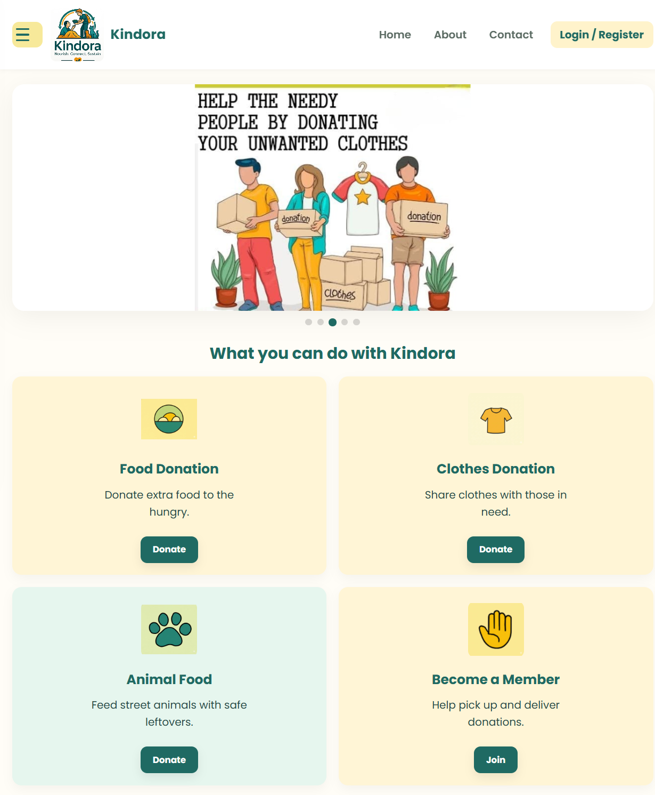
  </a>
  <a href="screenshots/Homepage-2.png">
    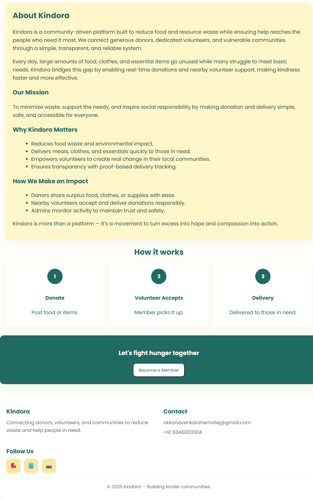
  </a>

---

### 🔐 Authentication

  <a href="screenshots/Loginpage.png">
    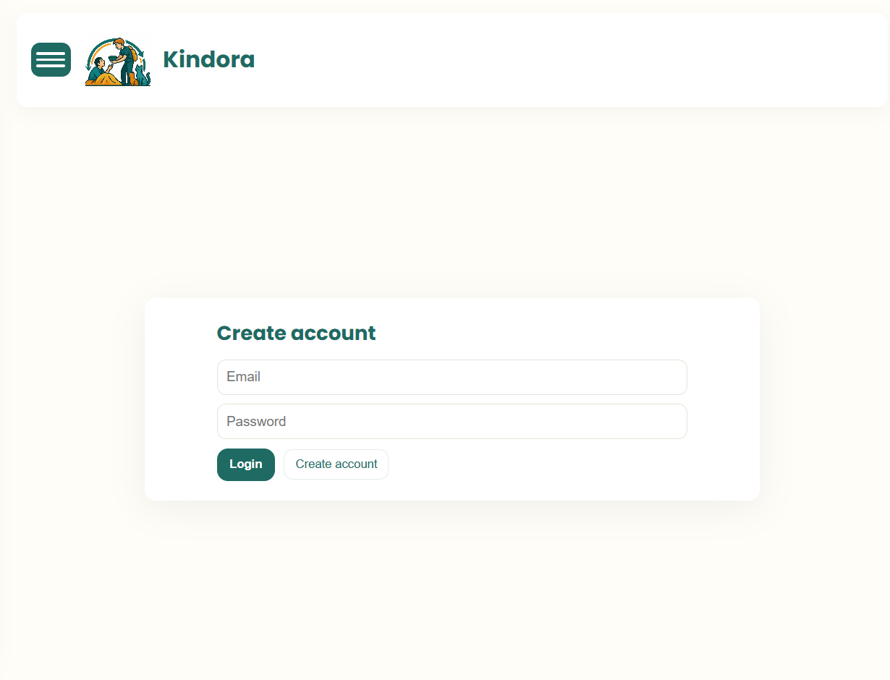
  </a>
  <a href="screenshots/Registerpage.png">
    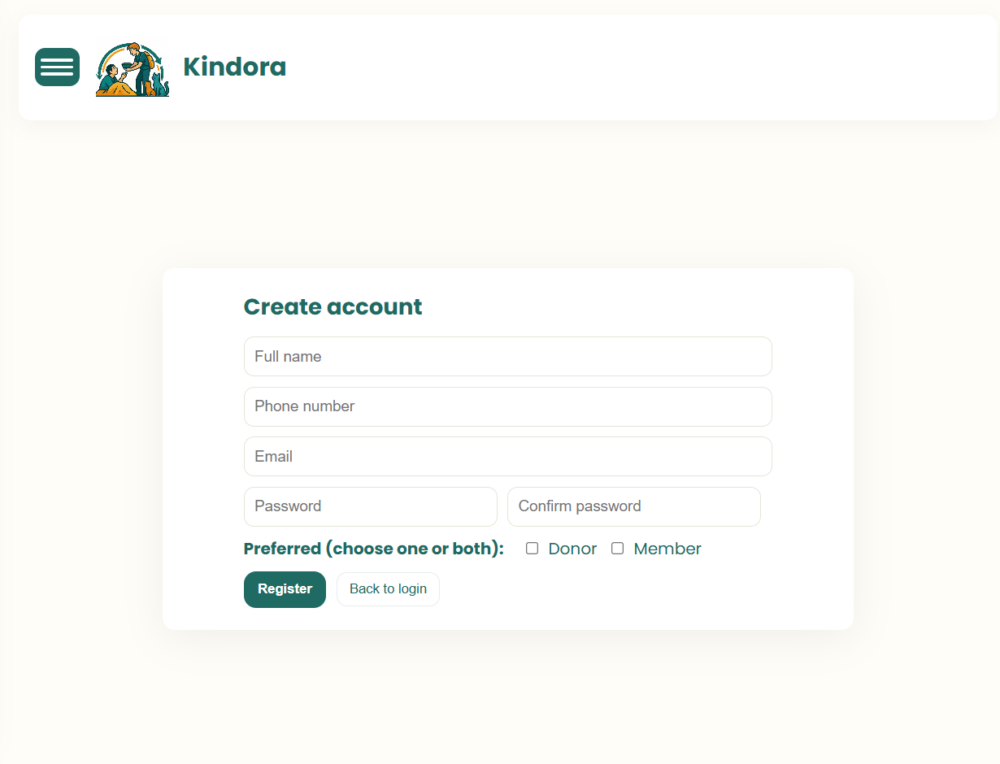
  </a>

---

### 🍲 👕 🐶 Donation Pages

  <a href="screenshots/Fooddonation.png">
    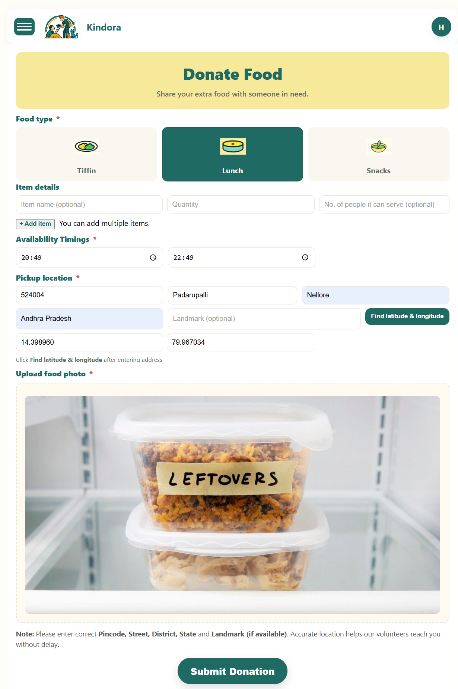
  </a>
  <a href="screenshots/clothesdonation.png">
    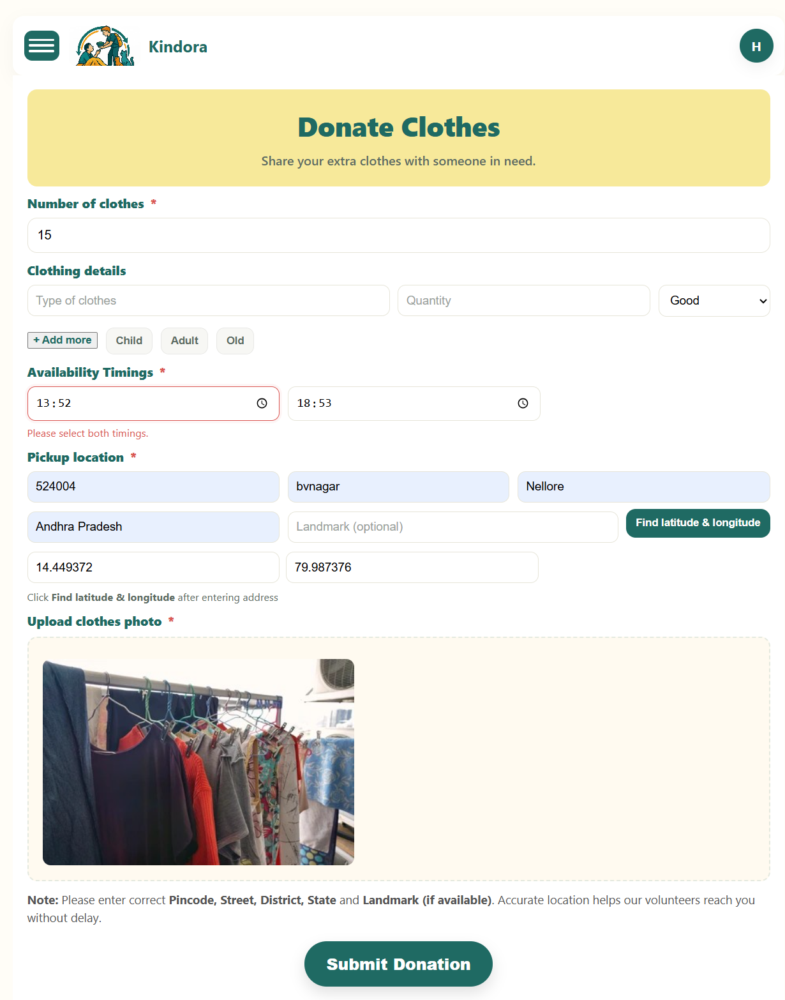
  </a>
  <a href="screenshots/animalfood.png">
    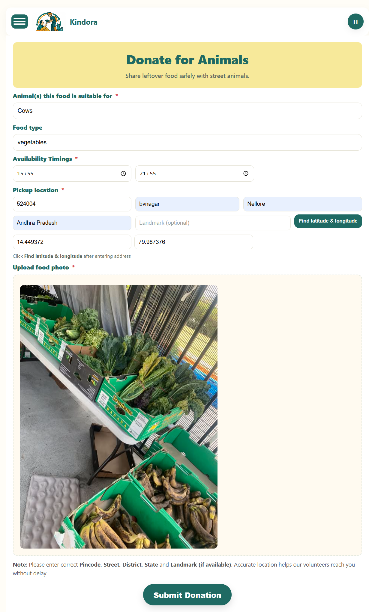
  </a>

---

### 📊 Dashboards

  <a href="screenshots/DonarDashboard.png">
    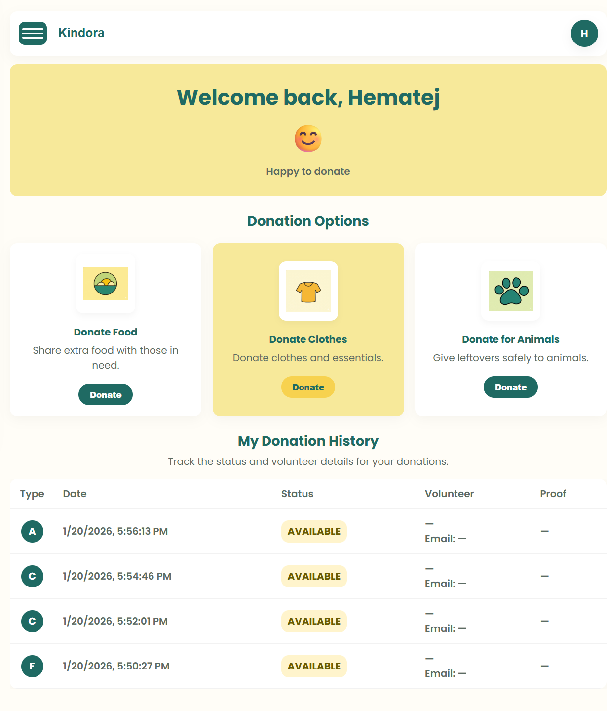
  </a>
  <a href="screenshots/MemberDashboard.png">
    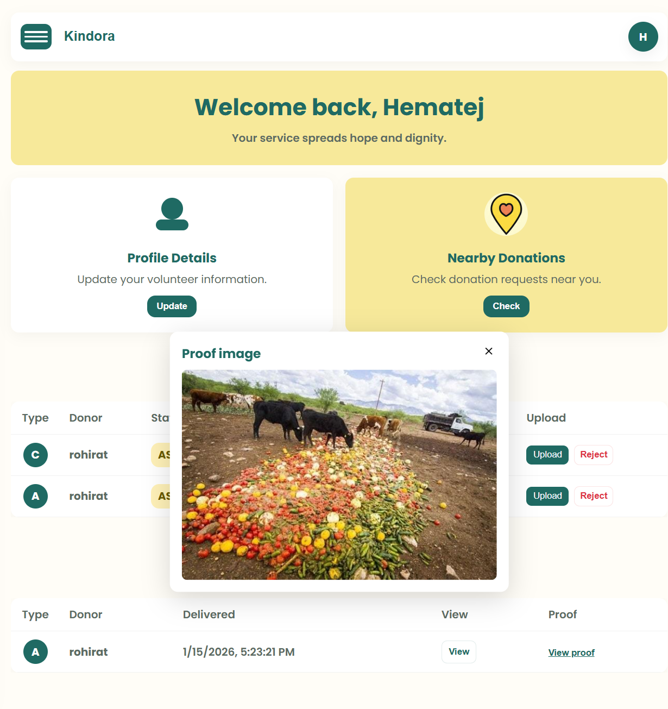
  </a>

---

### 👤 Member Profile & Nearby Donations

  <a href="screenshots/memberprofile.png">
    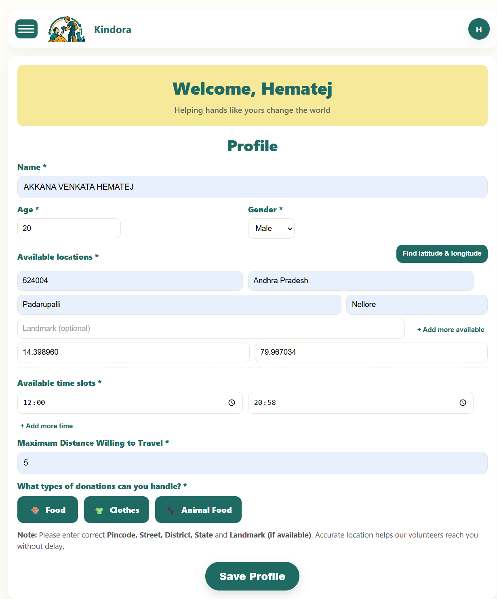
  </a>
  <a href="screenshots/Nearbydonation.png">
    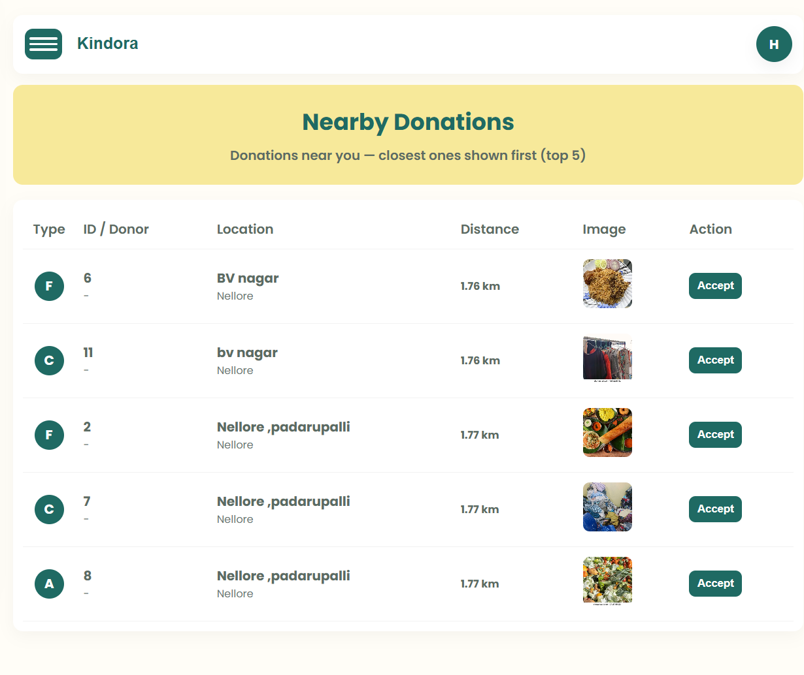
  </a>

---

### 📦 Donation Details

  <a href="screenshots/Donardetails.png">
    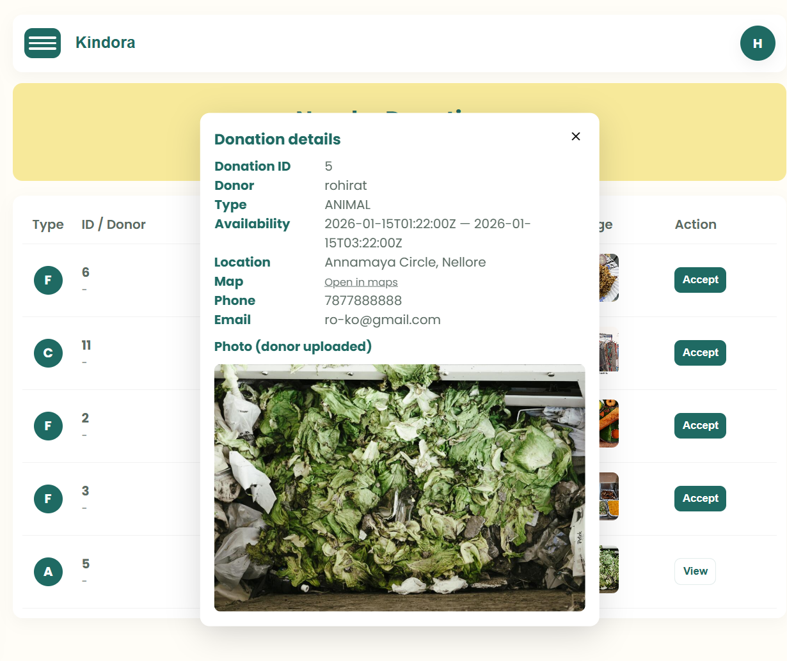
  </a>

---

## 🚀 Key Highlights
- Role-based access (Donor & Member)
- Location-based donation discovery
- Image upload & delivery proof verification
- Secure authentication
- Real-world end-to-end donation workflow

---

## 🔮 Future Enhancements

Planned improvements for future versions of **Kindora**:

- 🔔 **Real-time notifications**
  - Notify donors when a member accepts a donation
  - Notify members when new nearby donations are available

- 🔐 **OTP-based login**
  - Secure login using mobile number & OTP

- 🗺️ **Google Maps API integration**
  - Exact real-time location tracking
  - Improved route navigation
  - Accurate distance-based matching

- 📱 **Mobile Application**
  - Android app using the same backend
  - Better accessibility for users

- 🌍 **Play Store Deployment**
  - Publish on Google Play Store
  - Make the platform available worldwide

---

## 👨‍💻 Author

**Akkana Venkata Hematej**  
B.Tech – Artificial Intelligence & Data Science  
📧 akkanavenkatahematej@gmail.com

---

⭐ Feel free to reach out for collaboration, feedback, or access to the source code.
